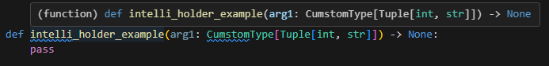

<!--StartFragment-->
 
from crimson.types_beta.addon.intelli_type import IntelliHolder, T

from typing import Tuple
 
class CumstomType(Tuple[int, str], IntelliHolder[T]):

&nbsp; &nbsp; """

&nbsp; &nbsp; CustomType with complex structure init.\n

&nbsp; &nbsp; We want to expose its inner structure by hover.\n

&nbsp; &nbsp; Therefore, we let this type hold `IntelliHolder[T]`\n

&nbsp; &nbsp; """

&nbsp;
 
def intelli_holder_example(arg1: CumstomType[Tuple[int, str]]) -&gt; None:

&nbsp; &nbsp; pass

<!--EndFragment-->

 
 

---

If you hover on the function, you must see the intellisense like below,

